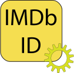
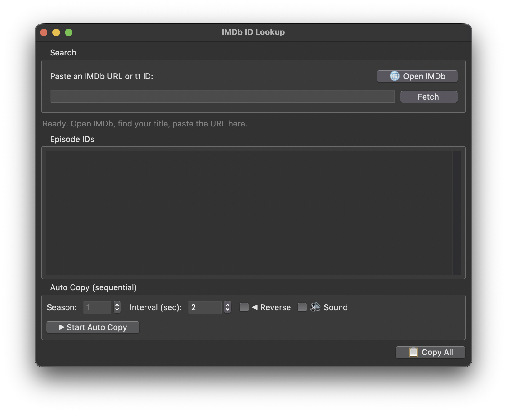

<div align="center">



# Batch Get IMDb ID


A desktop application to batch fetch IMDb episode IDs from TV series — perfect for media library organization.

[台灣繁體中文 請按這](README.zh-TW.md)

</div>

---

## Table of Contents 📖

- [Features ✨](#features-)
- [Screenshots 📸](#screenshots-)
- [Usage 🚀](#usage-)
    - [Running from Source 🐍](#running-from-source-)
    - [Running from Release 📦](#running-from-release-)
- [Build It Yourself 🛠](#build-it-yourself-)
    - [Prerequisites ✅](#prerequisites-)
    - [Building 🚧](#building-)
- [Notes 📝](#notes-)
    - [Known Bugs 🐛](#known-bugs-)
- [Issues / Bugs? 🙋‍♀️](#issues--bugs-)

---

## Features ✨

Tired of manually looking up IMDb IDs for every episode? This tool does it for you!

- **Batch fetch**: Paste any IMDb URL or tt ID, and get all episode IDs for the entire series.
- **Auto-copy mode**: Automatically copy episode IDs one by one at a set interval — great for pasting into metadata tools.
- **Season selection**: Choose which season to auto-copy.
- **Reverse order**: Copy episodes in reverse order if needed.
- **Sound effects**: Optional audio feedback when copying.
- **Cross-platform**: Works on macOS, Windows, and Linux.
- **Dark/Light mode**: Automatically adapts to your system theme.

---

## Screenshots 📸



---

## Usage 🚀

### Running from Source 🐍

1. Clone the repository:
   ```bash
   git clone https://github.com/SamWang8891/batch-get-imdbid.git
   cd batch-get-imdbid
   ```

2. Install dependencies:
   ```bash
   pip install -r requirements.txt
   ```

3. Run the app:
   ```bash
   python main.py
   ```

### Running from Release 📦

1. Download the release for your platform from the [Releases](https://github.com/SamWang8891/batch-get-imdbid/releases) page.
2. Extract and run the executable.

### How to Use 🎯

1. Open IMDb and find your TV series / anime.
2. Copy the URL (or just the tt ID like `tt1234567`).
3. Paste it into the app and click **Fetch**.
4. Browse the episode IDs or use **Auto Copy** to copy them one by one.
5. Use **Copy All** to grab everything at once.

---

## Build It Yourself 🛠

### Prerequisites ✅

- Python >= 3.10
- Required packages: `requests`, `beautifulsoup4`

### Building 🚧

#### Using PyInstaller 📦

1. Install PyInstaller:
   ```bash
   pip install pyinstaller
   ```

2. Build the executable:
   ```bash
   pyinstaller --onefile --windowed --add-data "sounds:sounds" main.py
   ```

3. Find your executable in the `dist` folder.

---

## Notes 📝

### Sound Files 🔊

Sound files are located in the `sounds` folder:
- `copy_sound.mp3` — plays on each auto-copy
- `done_sound.mp3` — plays when auto-copy completes

### Known Bugs 🐛

- None reported yet.

---

## Issues / Bugs? 🙋‍♀️

Encounter issues or bugs? Feel free to report them in Issues and submit Pull Requests.
